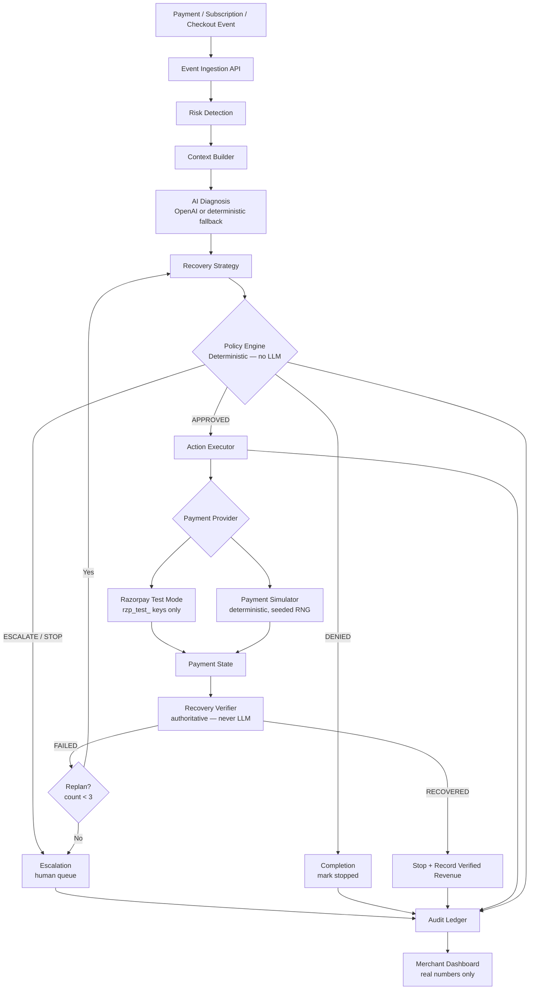
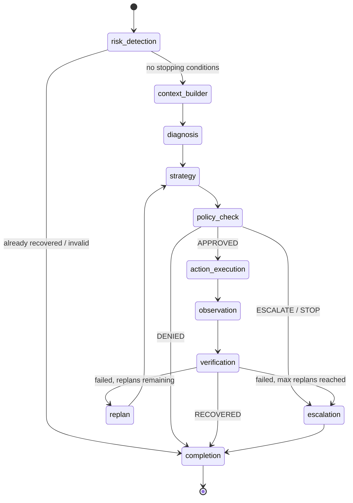

# RevenueRescue AI

> **Detect failed revenue. Diagnose why. Recover it safely.**

**Razorpay Buildathon — Track 03: AI Revenue Recovery**

[](https://github.com/Mouryaveer/revenue-rescue-ai/actions/workflows/backend.yml)
[](https://github.com/Mouryaveer/revenue-rescue-ai/actions)
[](https://www.python.org/)
[](https://nodejs.org/)
[](https://github.com/langchain-ai/langgraph)

---

RevenueRescue AI is an agentic revenue recovery engine. It detects payments at risk, diagnoses the underlying failure, proposes the next best recovery action, passes that action through a **deterministic policy gate**, executes only what is authorized, and **independently verifies whether the payment actually recovered** before recording any revenue.

```
Failed Payment → AI Diagnosis → Recovery Decision → Policy Gate → Simulator / Razorpay Test Mode → Verified Payment → ₹ Recovered → Audit Trail
```

**The LLM reasons. It never executes financial actions, never authorizes itself, and never declares revenue recovered.**  
Policy enforcement and recovery verification are deterministic — fully independent of the LLM.

---

## 🏆 Razorpay Buildathon — Track 03

> *"Find revenue that's slipping away and win it back."*

| Track Requirement | RevenueRescue AI |
|---|---|
| Detect revenue at risk | Event ingestion for failed payments, failed subscriptions, checkout abandonment |
| Determine best intervention | LangGraph agent: diagnosis → strategy selection, context-aware per failure type |
| Execute recovery workflow | 10-node state machine: detect → diagnose → decide → authorize → execute → observe → verify → stop/replan/escalate |
| Measured money recovered | Verified-only: `RecoveryVerifier` is the sole authority; LLM output never counts as recovered |
| Compliant escalation | 14-step policy pipeline; high-value (>₹50,000), unknown failures, low confidence all escalate to human |
| Stopping rules | Hard stops: max retries (3), payment already succeeded, customer opted out, case already recovered |
| Audit trail | Append-only, 19 event types, every decision captures actor + policy version + amount + reason |

---

## The Problem

Every SaaS and fintech business loses revenue daily to payment failures. The typical response — scheduled retries — is blunt:

```
Failure → Retry after 24h → Retry after 48h → Retry after 72h → Give up
```

This ignores the reason for failure. A temporary gateway error has a 70–90% recovery probability on immediate retry. An expired card has 0% — until the customer updates their method. Retrying an expired card three times contacts the customer unnecessarily and wastes retries.

The recovery opportunity requires context:

```
Failure
  ↓ Why did this fail?
  ↓ What is the customer's payment history?
  ↓ Is this failure pattern transient or structural?
  ↓ What action has the highest expected recovery value?
  ↓ Is that action authorized under merchant policy?
  ↓ Execute only if authorized
  ↓ Did the payment actually succeed?
  ↓ Stop if yes. Replan if no. Escalate if exhausted.
```

---

## What Makes This Agentic

This is not a chatbot. It is not a dashboard. It is not a prediction model.

It is a **bounded execution loop** with seven distinct phases:

| Phase | What happens | Who does it |
|---|---|---|
| **Detection** | Revenue-risk event classified by scenario and failure type | Deterministic risk detector |
| **Diagnosis** | LLM reasons about why the failure occurred | LLM (OpenAI or deterministic fallback) |
| **Strategy** | LLM selects the best recovery action given context | LLM |
| **Authorization** | Deterministic policy gate approves / denies / escalates | Policy Engine — zero LLM involvement |
| **Execution** | Authorized action executed through payment provider | Action Executor |
| **Observation** | System logs the payment response | Observation node |
| **Verification** | Payment state checked against authoritative source | Recovery Verifier — never LLM claim |
| **Replanning** | On failure: agent returns to strategy (max 3 replans) | Deterministic router |
| **Stopping** | Hard stop when a terminal condition is reached | Deterministic router |

---

## Architecture



---

## Agent State Machine



**Node inventory:**

| Node | Type | Description |
|------|------|-------------|
| `risk_detection` | Deterministic | Guards: already recovered, zero amount, invalid event |
| `context_builder` | Deterministic | Builds case context (currently appends trace) |
| `diagnosis` | **LLM** | Produces `DiagnosisOutput`: failure category, confidence, recommended strategy |
| `strategy` | **LLM** | Produces `StrategyOutput`: recovery action, reason, expected value |
| `policy_check` | Deterministic | Calls `PolicyEngine.authorize()` — returns APPROVED / DENIED / ESCALATE / STOP |
| `action_execution` | Deterministic | Calls simulator/Razorpay only if `policy_result.decision == "APPROVED"` |
| `observation` | Deterministic | Logs payment response into state |
| `verification` | Deterministic | Calls `RecoveryVerifier` — sole source of truth for recovery |
| `escalation` | Deterministic | Sets `escalation_reason`, `case_is_stopped = True` |
| `completion` | Deterministic | Final state — propagates denial reason if DENIED |
| `replan` | Deterministic | Increments `replan_count` (max 3), routes back to `strategy` |

---

## 🔐 Bounded Autonomy

The LLM cannot authorize itself. Every proposed action passes through a deterministic policy gate before anything executes.

```
LLM Output (StrategyOutput — Pydantic validated)
    ↓
Policy Engine (deterministic, independently testable, zero LLM)
    ↓
APPROVED → Action Executor → Payment Provider
DENIED   → Completion (case stopped, audit event recorded)
ESCALATE → Escalation queue (human review required)
STOP     → Completion (terminal condition, no further actions)
```

**Active policy rules** (`policies/defaults/merchant_default_v1.json`):

| Rule | Value | Effect on violation |
|------|-------|---------------------|
| `max_retries` | 3 | ESCALATE |
| `max_auto_recovery_amount_paise` | ₹50,000 | ESCALATE |
| `min_retry_interval_hours` | 24h | DENY |
| `max_messages_per_case` | 3 | DENY |
| `stop_on_payment_success` | true | STOP |
| `stop_on_opt_out` | true | DENY |
| `stop_on_suspension` | true | DENY |
| `max_checkout_recovery_messages` | 2 | DENY |
| `unknown_failure` escalation | true | ESCALATE |
| `low_confidence_threshold` | 0.5 | ESCALATE |

Policies are deterministic, independently testable, and **externally stored**. They cannot be modified by the LLM.

---

## Recovery Verification

**Agent decision ≠ recovery. Tool execution ≠ recovery. Only a verified payment state counts.**

```
Action Executor runs retry
    ↓
Payment Simulator / Razorpay returns outcome
    ↓
RecoveryVerifier.verify_payment_attempt(payment_result)
    ↓
outcome == SUCCESS  →  RECOVERED  →  amount_recovered_paise recorded
outcome == FAILED   →  NOT RECOVERED  →  replan or escalate
outcome == PENDING  →  NOT RECOVERED  →  wait / replan
```

`RecoveryVerifier` is the sole authority. The LLM cannot claim recovery. The dashboard only sums `amount_recovered_paise` from cases where `is_recovered = True` — set exclusively by the verifier.

---

## Stopping Rules

The agent **must stop** when any of these conditions are reached:

- ✅ Payment verified as recovered
- 🚫 `retry_count >= 3` (max retries)
- 🚫 `payment_already_succeeded` (payment succeeded before agent ran)
- 🚫 `case_is_recovered` (idempotency — already done)
- 🚫 Customer opted out of all communication
- 🚫 Customer account suspended
- 🚫 Amount exceeds ₹50,000 auto-recovery limit → escalate
- 🚫 Unknown failure reason → escalate for human review
- 🚫 Diagnosis confidence < 50% → escalate
- 🚫 Max replans (3) exhausted with no recovery → escalate

---

## Supported Recovery Scenarios

| Scenario | Failure types | Recovery actions |
|----------|---------------|-----------------|
| **Failed Payment** | `INSUFFICIENT_FUNDS`, `BANK_DECLINE`, `EXPIRED_METHOD`, `GATEWAY_TEMPORARY`, `AUTH_FAILURE` | Retry, schedule retry, payment method update reminder |
| **Failed Subscription** | `MANDATE_FAILURE`, `SUBSCRIPTION_GRACE`, `INSUFFICIENT_FUNDS` | Retry within grace window, reminder |
| **Checkout Abandonment** | `CHECKOUT_ABANDONED` | Recovery message → simulate customer resume → verify payment |

**Checkout abandonment** is fully implemented: the agent sends a recovery message, checks if the customer resumed, and verifies the resulting payment — subject to timeout, amount minimum, and message count limits enforced by policy.

---

## Razorpay Integration vs Simulator

### Razorpay Test Mode (`PAYMENT_PROVIDER=razorpay_test`)

Uses the official `razorpay==1.4.2` SDK with test-mode credentials.

| Capability | Status |
|------------|--------|
| Authentication (`rzp_test_` keys only) | ✅ Implemented — production keys refused at startup |
| Create payment order (`client.order.create`) | ✅ Implemented |
| Fetch payment status (`client.payment.fetch`) | ✅ Implemented |
| Subscriptions | ⚪ Not implemented |
| Webhooks | ⚪ Not implemented |

The provider validates that `RAZORPAY_KEY_ID` starts with `rzp_test_` — if a production key (`rzp_live_`) is provided, the application **refuses to start**. This is enforced in `config.py` via a Pydantic field validator.

> Full payment capture (beyond order creation) requires Razorpay Checkout.js on the frontend. For the hackathon demo, order creation confirms live API connectivity.

### Payment Simulator (`PAYMENT_PROVIDER=simulator`, default)

A deterministic, seeded synthetic payment environment. Every experiment is reproducible.

**Why the simulator exists:**
- No real credentials required — runs out of the box
- Reproducible batch experiments (same seed → same outcomes)
- Configurable failure scenarios (8 failure types, 4 customer segments)
- Safe failure injection without real-money risk
- Supports 10,000+ event batch evaluation

**Retry success probabilities (from `simulator/engine/payment_simulator.py`):**

| Failure Reason | Retry 1 | Retry 2 | Retry 3 |
|----------------|---------|---------|---------|
| `GATEWAY_TEMPORARY` | 70% | 90% | 95% |
| `INSUFFICIENT_FUNDS` | 40% | 60% | 75% |
| `MANDATE_FAILURE` | 30% | 50% | 65% |
| `BANK_DECLINE` | 25% | 45% | 55% |
| `AUTH_FAILURE` | 20% | 35% | 45% |
| `EXPIRED_METHOD` | 0% | 0% | 0% |
| `UNKNOWN` | 10% | 15% | 20% |

Customer segment modifiers: standard (1.0×), premium (1.15×), enterprise (1.25×), at_risk (0.75×).

---

## Batch Evaluation

The system includes a batch simulation engine for reproducible experiments comparing **RevenueRescue AI** against a **fixed-retry baseline**.

**Latest recorded experiment (1,000 events, `seed=42`):**

| Metric | RevenueRescue AI | Fixed-Retry Baseline |
|--------|-----------------|----------------------|
| Events | 1,000 | 1,000 |
| Recovered cases | 633 | 297 |
| Recovery rate | **70.83%** | **35.8%** |
| Policy violations | **0** | 0 |
| Random seed | 42 | 42 |

*Both runs used identical synthetic datasets generated from `seed=42`. Results are reproducible — run `POST /api/v1/simulation/run` with `random_seed: 42` to verify.*

**Baseline:** Single retry attempt, no diagnosis, no context, no policy-aware stopping. Results are real simulation outputs, not fabricated.

**Metrics defined:**

```
Recovery Rate       = Verified Recovered Revenue / Total Revenue at Risk × 100
Policy Violation    = Authorized DENIED case that still executed (architecture: always 0)
Escalation Rate     = Escalated Cases / Total Cases
Revenue Recovered   = SUM(amount_recovered_paise WHERE is_recovered = True)
```

---

## Tech Stack

| Layer | Technology | Why |
|-------|-----------|-----|
| **Frontend** | Next.js 14, TypeScript, Tailwind CSS | App Router, server components, design tokens |
| **Charts** | Recharts | Recovery funnel, scenario breakdown, baseline comparison |
| **State** | TanStack Query v5 | Real-time polling with auto-refetch |
| **Backend** | FastAPI 0.115, Python 3.12 | Async-first, Pydantic v2 validation, OpenAPI auto-docs |
| **Agent** | LangGraph 0.2.45 + LangChain 0.3.7 | TypedDict state machine, explicit edges, conditional routing |
| **LLM** | OpenAI (optional) or MockProvider | Structured JSON output; deterministic fallback needs no API key |
| **Database** | PostgreSQL 16 + SQLAlchemy 2 (async) | UUID PKs, JSONB, append-only audit table |
| **Migrations** | Alembic | Schema versioning |
| **Cache / Queue** | Redis 7 + Celery 5 | Background task isolation |
| **Simulation** | Faker, NumPy, Pandas, seeded RNG | Reproducible synthetic datasets |
| **Payment SDK** | `razorpay==1.4.2` | Test-mode order creation and payment fetch |
| **Auth** | python-jose + passlib/bcrypt | JWT, RBAC (MERCHANT_ADMIN / OPERATOR / AUDITOR) |
| **Logging** | structlog | Structured JSON, request correlation IDs |
| **Testing** | Pytest, Vitest, Playwright | Unit, integration, red-team, E2E |
| **Quality** | Ruff 0.15.11, Bandit 1.9.4 | Lint, format, security scan |
| **CI** | GitHub Actions | Lint + tests on every push to `main` |
| **Dev** | Docker Compose | One-command startup |

---

## Project Structure

```
revenue-rescue-ai/
│
├── backend/                FastAPI application
│   ├── app/
│   │   ├── api/v1/         21 endpoints across 9 routers
│   │   ├── core/           Config, database, security, Celery
│   │   ├── models/         15 SQLAlchemy models (UUID PKs)
│   │   ├── providers/      PaymentProvider abstraction
│   │   │   ├── base.py     Abstract interface
│   │   │   ├── simulator_provider.py
│   │   │   └── razorpay_test_provider.py
│   │   └── services/       Business logic (recovery, simulation, metrics)
│   └── requirements.txt
│
├── agents/
│   ├── graph/              LangGraph state machine (recovery_graph.py)
│   ├── nodes/              11 nodes (2 LLM, 9 deterministic)
│   ├── prompts/            Diagnosis and strategy prompt templates
│   ├── schemas/            AgentState TypedDict, DiagnosisOutput, StrategyOutput
│   └── tools/              9 tool schemas (validated proposals — not direct executors)
│
├── policies/
│   ├── engine/             PolicyEngine — deterministic, zero LLM
│   ├── schemas/            PolicyConfig Pydantic model
│   ├── defaults/           merchant_default_v1.json
│   └── tests/              35 tests including red-team
│
├── simulator/
│   ├── engine/             PaymentSimulator, RecoveryVerifier, BaselineSimulator
│   └── generators/         CustomerGenerator, PaymentEventGenerator
│
├── database/
│   ├── migrations/         Alembic migrations
│   └── seed/               Demo seed (20 deterministic cases)
│
├── frontend/               Next.js 14 dashboard (10 pages)
│
├── tests/
│   ├── integration/        8 E2E pipeline tests
│   └── redteam/            25 mandatory safety tests
│
├── docs/                   Architecture docs
├── docker-compose.yml
├── .env.example
├── Makefile
└── pyproject.toml          Ruff + Bandit + pytest config
```

---

## Quick Start

### Prerequisites

- Docker Desktop (recommended)
- Git

### 1. Clone

```bash
git clone https://github.com/Mouryaveer/revenue-rescue-ai.git
cd revenue-rescue-ai
```

### 2. Configure environment

```bash
cp .env.example .env
```

**Minimum required changes** (for simulation mode — no external credentials needed):

```env
APP_SECRET_KEY=any-long-random-string
JWT_SECRET=another-long-random-string
LLM_PROVIDER=mock               # No OpenAI key needed
PAYMENT_PROVIDER=simulator      # No Razorpay key needed
```

**To use Razorpay Test Mode** (optional):

```env
PAYMENT_PROVIDER=razorpay_test
RAZORPAY_KEY_ID=rzp_test_...    # Must start with rzp_test_
RAZORPAY_KEY_SECRET=...
```

> Production Razorpay keys (`rzp_live_`) are rejected at startup. No real money is ever involved.

**To use OpenAI** (optional — system works without it):

```env
LLM_PROVIDER=openai
OPENAI_API_KEY=sk-...
OPENAI_MODEL=gpt-4o
```

### 3. Start all services

```bash
docker compose up --build
```

This starts: PostgreSQL 16, Redis 7, FastAPI backend (port 8000), Celery worker, Next.js frontend (port 3000).

### 4. Run migrations and seed demo data

```bash
make migrate   # Apply Alembic migrations
make demo      # Seed 20 deterministic demo cases
```

### 5. Open the dashboard

**http://localhost:3000** — loads with seeded cases showing all scenario types.

API documentation (auto-generated): **http://localhost:8000/docs**

---

## Running Without Docker

```bash
# Backend
python -m venv .venv
.venv\Scripts\activate          # Windows
source .venv/bin/activate       # macOS/Linux
pip install -r backend/requirements.txt

# Set DATABASE_URL to point at a local Postgres instance
uvicorn app.main:app --reload --port 8000 --app-dir backend

# Frontend (separate terminal)
cd frontend
npm install
npm run dev
```

---

## Triggering a Recovery Case

```bash
# Ingest a failed payment — agent runs automatically in background
curl -X POST http://localhost:8000/api/v1/events/payment-failed \
  -H "Content-Type: application/json" \
  -d '{
    "idempotency_key": "test-001",
    "customer_id": "cust-001",
    "amount_paise": 149900,
    "currency": "INR",
    "failure_reason": "INSUFFICIENT_FUNDS"
  }'
# Returns: {"recovery_case_id": "...", "status": "ACCEPTED"}

# Wait ~5s, then check result
curl http://localhost:8000/api/v1/recovery-cases/{recovery_case_id}
# status=RECOVERED | policy_decision=APPROVED | is_recovered=true

# View audit trail
curl http://localhost:8000/api/v1/recovery-cases/{recovery_case_id}/audit
```

---

## Sample Recovery Flow

```
Payment Failed — ₹1,499 — INSUFFICIENT_FUNDS
    ↓
risk_detection: valid event, not previously recovered
    ↓
diagnosis (LLM/fallback):
  failure_category = "INSUFFICIENT_FUNDS"
  recommended_strategy = "SCHEDULE_RETRY"
  confidence = 0.75
    ↓
strategy (LLM/fallback):
  recovery_strategy = "SCHEDULE_RETRY"
  requested_action = {type: "schedule_retry", delay_hours: 24}
    ↓
policy_check (deterministic):
  retry_count=0 < max_retries=3  ✓
  amount=₹1,499 < ₹50,000 limit  ✓
  customer not opted out          ✓
  → APPROVED
    ↓
action_execution:
  simulator.execute_retry(..., retry_number=1)
  → outcome = SUCCESS (seeded RNG: INSUFFICIENT_FUNDS retry 1 = 40%)
    ↓
verification:
  RecoveryVerifier.verify_payment_attempt(payment_result)
  outcome == SUCCESS → RECOVERED
  amount_recovered_paise = 149900
    ↓
completion:
  is_recovered = True
  case_is_stopped = True
  → STOP

Revenue Recovered: ₹1,499
Audit events: CASE_CREATED → AGENT_RUN_STARTED → REVENUE_RECOVERED → AGENT_RUN_COMPLETED
```

*Sample only. Actual outcome depends on the seeded RNG. Recovery probability for INSUFFICIENT_FUNDS retry 1 = 40% at standard customer segment.*

---

## 🎬 5-Minute Hackathon Demo

### Setup
```bash
make demo   # Reset + reseed deterministic cases
```

### Flow

**0:00–0:30 — The problem**
Open `/overview`. Show Revenue at Risk vs Revenue Recovered. All numbers from real DB.

**0:30–1:30 — Trigger a live recovery**
```bash
curl -X POST http://localhost:8000/api/v1/events/payment-failed \
  -H "Content-Type: application/json" \
  -d '{"idempotency_key":"demo-live-1","customer_id":"demo-cust","amount_paise":299900,"currency":"INR","failure_reason":"GATEWAY_TEMPORARY"}'
```
Wait 5 seconds. Open `/command`. Select the new case. Watch pipeline nodes advance.

**1:30–2:30 — Audit trail**
Open `/cases/{id}` → Audit tab. Show: `CASE_CREATED → AGENT_RUN_STARTED → REVENUE_RECOVERED → AGENT_RUN_COMPLETED`. Every event has actor, policy version, amount.

**2:30–3:30 — Policy safety boundary**
```bash
# High-value — should escalate, never auto-recover
curl -X POST http://localhost:8000/api/v1/events/payment-failed \
  -H "Content-Type: application/json" \
  -d '{"idempotency_key":"demo-hv","customer_id":"hv-cust","amount_paise":7500000,"currency":"INR","failure_reason":"BANK_DECLINE"}'
```
Result: `status=ESCALATED`, `policy_decision=ESCALATE`, `is_recovered=false`.  
Open `/overview` — **Policy Violations = 0**.

**3:30–4:15 — Demo scenarios**
Open `/demo`. Run `Demo-003` (4th retry attempt → POLICY DENIED). Run `Demo-006` (opted-out customer → immediate DENIED). Show that **no financial action executes** in either case.

**4:15–5:00 — Batch results**
Open `/simulation`. Run "Standard Run" (1,000 events, seed=42) AI + Baseline. Compare: AI ~70% vs Baseline ~36%.

---

## Running Tests

```bash
# Full suite — no Docker needed
python -m pytest policies/tests/ simulator/tests/ agents/tests/ \
                 tests/redteam/ tests/integration/ \
                 backend/tests/unit/ backend/tests/integration/ \
                 -v --tb=short
# Expected: 130 passed, 1 warning
```

**Individual suites:**

```bash
python -m pytest policies/tests/ -v      # 35 tests — policy engine (all 14 rules)
python -m pytest simulator/tests/ -v     # 23 tests — simulator + verifier + baseline
python -m pytest agents/tests/ -v        # 22 tests — full LangGraph pipeline
python -m pytest tests/redteam/ -v       # 25 tests — mandatory safety tests
python -m pytest tests/integration/ -v   # 8 tests  — E2E recovery pipeline
python -m pytest backend/tests/ -v       # 17 tests — API schemas, scoring
```

**Critical red-team test:**

```bash
python -m pytest tests/redteam/test_redteam.py::test_rt09_action_not_executed_without_policy_approval -v
# Verifies: LLM proposes action → Policy DENIED → Executor does NOT run → case stopped
```

**Code quality:**

```bash
python -m ruff check .                              # Lint
python -m ruff format --check .                     # Format
python -m bandit -r backend/app agents policies simulator -x tests -c pyproject.toml
```

---

## API Reference

Full interactive docs at `http://localhost:8000/docs`.

| Method | Endpoint | Description |
|--------|----------|-------------|
| `GET` | `/health` | Health check |
| `GET` | `/api/v1/environment` | Active mode: `SIMULATION MODE` or `RAZORPAY TEST MODE` |
| `POST` | `/api/v1/auth/register` | Register user |
| `POST` | `/api/v1/auth/login` | JWT login |
| `POST` | `/api/v1/events/payment-failed` | Ingest payment failure (idempotent) |
| `POST` | `/api/v1/events/checkout-abandoned` | Ingest checkout abandonment (idempotent) |
| `GET` | `/api/v1/recovery-cases` | List cases with filters |
| `GET` | `/api/v1/recovery-cases/{id}` | Case detail + diagnosis + strategy + policy decision |
| `POST` | `/api/v1/recovery-cases/{id}/run` | Manually trigger agent (202 Accepted) |
| `POST` | `/api/v1/recovery-cases/{id}/escalate` | Manual escalation |
| `GET` | `/api/v1/recovery-cases/{id}/audit` | Full case audit trail |
| `GET` | `/api/v1/metrics/overview` | KPIs: revenue at risk, recovered, rate, escalations, violations |
| `GET` | `/api/v1/metrics/baseline-comparison` | AI vs baseline comparison by run ID |
| `GET` | `/api/v1/policies/active` | Active policy configuration |
| `POST` | `/api/v1/policies` | Create new policy version |
| `POST` | `/api/v1/simulation/run` | Start batch simulation (202 Accepted) |
| `GET` | `/api/v1/simulation/{id}` | Simulation status + results |
| `GET` | `/api/v1/simulation` | List all simulation runs |
| `GET` | `/api/v1/audit` | Global audit log |
| `GET` | `/api/v1/demo/scenarios` | 7 deterministic demo scenarios |
| `POST` | `/api/v1/demo/run/{id}` | Run a demo scenario |
| `POST` | `/api/v1/demo/reset` | Reset and reseed demo data |

---

## Security Model

| Concern | Implementation |
|---------|---------------|
| **No real payment data** | All customer data synthetic (Faker); no real card numbers or PII |
| **Production key rejection** | `rzp_live_` keys refused at startup via Pydantic `field_validator` |
| **LLM output validation** | `DiagnosisOutput` and `StrategyOutput` validated with Pydantic v2; malformed output triggers deterministic fallback |
| **Prompt injection** | All customer metadata treated as untrusted; agent instructions cannot be overridden by metadata |
| **Tool authorization** | `node_action_execution` hard-checks `policy_result.decision == "APPROVED"` before calling simulator — DENIED result → no execution |
| **Audit immutability** | Append-only audit table; no UPDATE, no DELETE on `audit_events` |
| **Idempotency** | `source_event_key` unique constraint prevents duplicate recovery cases from repeated events |
| **Authentication** | JWT (python-jose), bcrypt password hashing, RBAC roles: MERCHANT_ADMIN / OPERATOR / AUDITOR |
| **Secrets** | `.env` excluded from git; never logged; no defaults committed |
| **Security scan** | Bandit 1.9.4 runs on every CI push |

---

## Failure Handling

| Failure | Behavior |
|---------|----------|
| LLM unavailable / malformed output | Deterministic fallback (`_fallback_diagnosis`, `_fallback_strategy`) — no crash |
| Policy engine error | Fail closed: returns `ESCALATE` — never `APPROVED` |
| Simulator / Razorpay unavailable | `PROVIDER_UNAVAILABLE` result → verification marks NOT RECOVERED → replan or escalate |
| Database unavailable | FastAPI dependency injection raises immediately — no silent data loss |
| Duplicate payment event | Idempotency key prevents duplicate recovery case creation; returns existing case ID with `is_duplicate: true` |
| Agent recursion exceeded | `recursion_limit=50` in `graph.invoke()` — catches runaway replan loops |
| Per-event agent failure in batch | Error isolated to that event; simulation continues; FAILED events counted separately |

---

## Observability

Every significant decision emits a structured log line via `structlog` with:
- `case_id` — UUID, correlates all events for one recovery
- `request_id` — HTTP request correlation
- `event_type` — one of 19 audit event types
- `actor` — RECOVERY_AGENT / POLICY_ENGINE / RECOVERY_VERIFIER / etc.
- `policy_version` — version number of the policy that authorized/denied
- `amount_paise` — monetary amount at each step
- `result` — outcome

**Audit event types:**

```
CASE_CREATED · DIAGNOSIS_COMPLETED · STRATEGY_PROPOSED
POLICY_APPROVED · POLICY_DENIED · POLICY_ESCALATE
ACTION_EXECUTED · PAYMENT_ATTEMPTED · PAYMENT_SUCCESS · PAYMENT_FAILED
CHECKOUT_RECOVERY_SENT · CHECKOUT_RESUMED
REVENUE_RECOVERED · ESCALATED · STOPPED
STRATEGY_REPLANNED · AGENT_RUN_STARTED · AGENT_RUN_COMPLETED
UNAUTHORIZED_ACTION_ATTEMPT
```

---

## Why This Architecture

**Why AI for diagnosis?**  
Rule-based systems cannot reason about context — customer history, failure pattern, subscription status, retry timing. The LLM produces a structured diagnosis with confidence score that informs the strategy without executing anything.

**Why deterministic policy enforcement?**  
Financial authorization cannot depend on probabilistic model output. Retry limits, amount thresholds, opt-out rules, and timing constraints must be enforced reliably. The policy engine is independently testable with no LLM involved.

**Why a separate verifier?**  
The action executor cannot determine its own success. Only the payment environment knows the true state. Separating verification from execution closes the loop between "we tried" and "money was actually recovered."

**Why an audit trail?**  
Every financial system needs accountability. Append-only audit events with policy version on every decision make the system auditable and debuggable.

---

## Limitations

- **Simulated payments:** The default mode uses synthetic data. No real payment processing.
- **Razorpay Test Mode:** Order creation is confirmed; full payment capture requires frontend Checkout.js integration (not implemented).
- **No webhooks:** Payment state updates from Razorpay webhooks are not implemented.
- **No subscriptions API:** Failed subscription recovery uses the simulator only; no Razorpay subscription API calls.
- **`context_builder` node:** Currently a placeholder — appends to trace but does not enrich state with live customer history.
- **`avg_recovery_time_hours`:** Metric defined but not yet computed from audit timestamps.
- **No production compliance:** This is a hackathon demo. Not production-grade, no PCI compliance, no real merchant deployment.

---

## Roadmap

**Near-term**
- Live customer history enrichment in `context_builder`
- Webhook receiver for Razorpay payment state updates
- Average recovery time computation from audit timestamps

**Medium-term**
- Razorpay Checkout.js integration for full test-mode payment capture
- Mandate recovery via Razorpay Subscriptions API
- Multi-channel communication (email, SMS) simulation

**Planned / Experimental**
- B2B receivables recovery (invoice overdue scenario)
- Promise-to-pay recording and follow-up
- Adaptive recovery strategy learning from historical outcomes
- Multi-tenant merchant policy management

---

## What Broke and How We Got Out

See [`docs/what-broke-and-how-we-got-out.md`](docs/what-broke-and-how-we-got-out.md) for documented incidents.

**Notable issues resolved during development:**

**LangGraph recursion limit (CRITICAL)**  
The default recursion limit of 25 caused AI simulations to fail silently after ~35 events in 1,000-event batch runs. The full pipeline (8 nodes + up to 3 replans × 6 nodes) uses up to ~26 steps per case. Fixed by setting `recursion_limit=50` in `graph.invoke(config={"recursion_limit": 50})`. Per-event error isolation added to prevent single-case failures from aborting entire batch runs.

**Policy violations counter miscounted DENIED decisions**  
`policy_violations` was counting all `DENIED` policy decisions as violations. A DENIED decision is correct policy behavior — it means the policy blocked an unsafe action, which is the intended outcome. A true violation would be a DENIED case that still executed. Fixed to count only `DENIED AND is_recovered = True` (which architecturally should always be 0).

**Simulator transaction IDs breaking audit writes**  
The simulator returns `TXN-XXXXXXXX` format transaction IDs (not valid UUIDs). The audit `transaction_id` column expects a UUID. Fixed with UUID validation before the DB write — non-UUID transaction refs are stored as `NULL` in the audit column rather than crashing the write.

---

## Development Principles

1. The LLM proposes. The Policy Engine authorizes. The Executor acts. The Verifier confirms.
2. Never count unverified payment success as recovered revenue.
3. Never execute an action without explicit policy authorization.
4. Deterministic rules for hard financial constraints; probabilistic reasoning for context.
5. Fail closed when authorization is unavailable.
6. Every recovery decision is auditable with policy version.
7. Measure outcomes (recovered revenue), not model accuracy.
8. Simulation mode and Razorpay Test Mode are always clearly labeled in the UI.
9. Secrets never leave the `.env` file. Never logged. Never committed.

---

## Capability Status

| Capability | Status |
|------------|--------|
| Failed payment recovery (3 scenarios) | ✅ Implemented |
| Subscription failure recovery | ✅ Implemented |
| Checkout abandonment recovery | ✅ Implemented |
| AI diagnosis (LLM + deterministic fallback) | ✅ Implemented |
| Policy engine (14 rules, fail-closed) | ✅ Implemented |
| Action execution (authorized only) | ✅ Implemented |
| Recovery verification (authoritative) | ✅ Implemented |
| Razorpay Test Mode (order creation + fetch) | ✅ Implemented |
| Razorpay webhook integration | ⚪ Planned |
| Razorpay Subscriptions API | ⚪ Planned |
| Full payment capture via Checkout.js | 🟡 Partial (order created; capture requires frontend) |
| Batch simulation (1,000–10,000 events) | ✅ Implemented |
| Baseline comparison | ✅ Implemented |
| Audit trail (19 event types) | ✅ Implemented |
| Merchant dashboard (10 pages) | ✅ Implemented |
| Demo Mode (7 deterministic scenarios) | ✅ Implemented |
| Customer history enrichment | 🟡 Placeholder node exists |
| Average recovery time metric | 🟡 Defined, not computed |
| Production deployment | ❌ Not implemented |

---

## Credits

**RevenueRescue AI**  
Razorpay Buildathon 2026 — Track 03: AI Revenue Recovery

---

*All payment data in this project is entirely synthetic. No real payments, no real customer data, no real money. The Razorpay integration uses test-mode credentials only (`rzp_test_` keys). No production financial operations are performed.*
